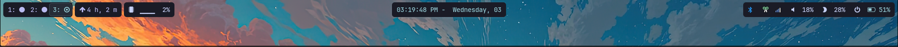

# 🌌 Hyprland Dotfiles

Minimal and aesthetic dotfiles for [Hyprland](https://github.com/hyprwm/Hyprland) on Fedora Linux.

---

## 📸 Screenshots

### Desktop


### Waybar


*(Place your screenshots inside a `screenshots/` folder in the repo.)*

---

## ⚙️ Features

- **Hyprland** window manager
- **Waybar** for status bar
- **Swaync** for notifications
- **Kitty** terminal with custom config
- **Wallpaper script** for automatic background

---

## 📦 Dependencies

Make sure you have these installed:

- [Hyprland](https://github.com/hyprwm/Hyprland)
- [Waybar](https://github.com/Alexays/Waybar)
- [Swaync](https://github.com/ErikReider/SwayNotificationCenter)
- [Kitty](https://sw.kovidgoyal.net/kitty/)
- [VLC](https://www.videolan.org/vlc/)
- A Nerd Font (e.g. JetBrainsMono Nerd Font)
- [Rofi](https://github.com/davatorium/rofi)
- [Wlogout](https://github.com/ArtsyMacaw/wlogout)
- [VLC](https://www.videolan.org/vlc/)
- [Brightnessctl](https://github.com/Hummer12007/brightnessctl)
- [Grim](https://sr.ht/~emersion/grim/)
- [Slurp](https://github.com/emersion/slurp)
- [Swappy](https://github.com/jtheoof/swappy)
- [PipeWire](https://pipewire.org/) *(for `wpctl` volume control)*
- [CopyQ](https://hluk.github.io/CopyQ/)
- [Hyprpicker](https://github.com/hyprwm/hyprpicker)
- [Pavucontrol](https://freedesktop.org/software/pulseaudio/pavucontrol/)


---

## 🚀 Installation

Clone the repo:

```bash
git clone git@github.com:AnshulVThomas/minimal-Hyprland-dots.git ~/.config

